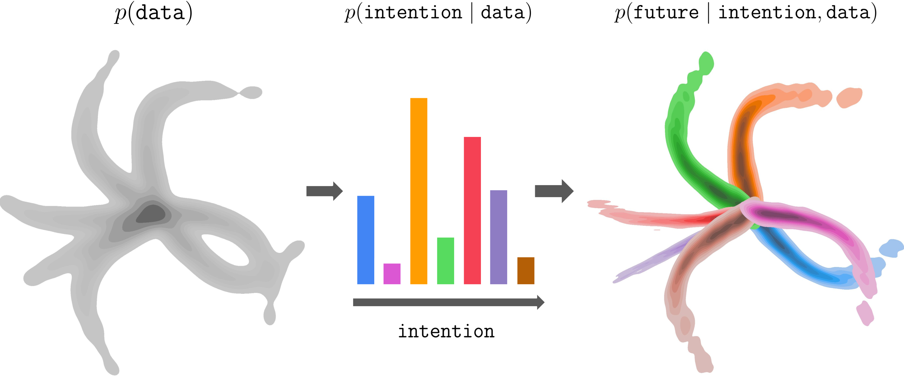

<div align="center">

<div id="user-content-toc" style="margin-bottom: 50px">
  <ul align="center" style="list-style: none;">
    <summary>
      <h1 style="font-size:1.76rem">
        Intention-Conditioned Flow Occupancy Models
      </h1>
      <br>
      <h2>
        <a href="" style="font-size:20px;">Paper</a>&emsp;
        <a href="https://chongyi-zheng.github.io/infom" style="font-size:20px;">Website</a>
      </h2>
    </summary>
  </ul>
</div>



</div>

## Overview

Intention-Conditioned Flow Occupancy Models (InFOM) is a latent variable model for pre-training and fine-tuning in reinforcement learning. (Left) The datasets are collected by users performing distinct tasks. (Center) We encode intentions by maximizing an evidence lower bound of data likelihood, (Right) enabling intention-aware future prediction using *flow matching*.

This repository contains code for running the InFOM algorithm and eight baselines.

## Installation

1. Create an Anaconda environment: `conda create -n infom python=3.10.16 -y`
2. Activate the environment: `conda activate infom`
3. Install the dependencies:
    ```
    conda install -c conda-forge glew -y
    conda install -c conda-forge mesalib -y
    pip install -r requirements.txt
    ```
4. Export environment variables
    ```
    export PYTHONPATH=path_to_infom_dir
    export MUJOCO_GL=egl
    export PYOPENGL_PLATFORM=egl
    ```

## Generate datasets

We provide scripts to generate datasets for pre-training and fine-tuning in the `data_gen_scripts` folder.

### ExORL

<details>
<summary><b>Click to expand the commands to generate ExORL datasets</b></summary>

The default directory to store the datasets is `~/.exorl`.

1. Download exploratory datasets
   ```
   ./data_gen_scripts/download.sh cheetah rnd
   ./data_gen_scripts/download.sh walker rnd
   ./data_gen_scripts/download.sh quadruped rnd
   ./data_gen_scripts/download.sh jaco rnd
   ```
2. Generate pre-training datasets
   ```
   # cheetah
   python data_gen_scripts/generate_exorl_dataset.py --env_name=cheetah_run --save_path=~/.exorl/data/rnd_reward_free_cheetah.hdf5 --skip_size=0 --dataset_size=5_000_000 --relabel_reward=0
   python data_gen_scripts/generate_exorl_dataset.py --env_name=cheetah_run --save_path=~/.exorl/data/rnd_reward_free_cheetah_val.hdf5 --skip_size=5_000_000 --dataset_size=50_000 --relabel_reward=0
   
   # walker
   python data_gen_scripts/generate_exorl_dataset.py --env_name=walker_walk --save_path=~/.exorl/data/rnd_reward_free_walker.hdf5 --skip_size=0 --dataset_size=5_000_000 --relabel_reward=0
   python data_gen_scripts/generate_exorl_dataset.py --env_name=walker_walk --save_path=~/.exorl/data/rnd_reward_free_walker_val.hdf5 --skip_size=5_000_000 --dataset_size=50_000 --relabel_reward=0

   # quadruped
   python data_gen_scripts/generate_exorl_dataset.py --env_name=quadruped_run --dataset_dir=~/.exorl/expl_datasets --save_path=~/.exorl/data/rnd_reward_free_quadruped.hdf5 --skip_size=0 --dataset_size=5_000_000 --relabel_reward=0
   python data_gen_scripts/generate_exorl_dataset.py --env_name=quadruped_run --dataset_dir=~/.exorl/expl_datasets --save_path=~/.exorl/data/rnd_reward_free_quadruped_val.hdf5 --skip_size=50_000 --dataset_size=500_000 --relabel_reward=0
   
   # jaco
   python data_gen_scripts/generate_exorl_dataset.py --env_name=jaco_reach_top_left --dataset_dir=~/.exorl/expl_datasets --save_path=~/.exorl/data/rnd_reward_free_jaco.hdf5 --skip_size=0 --dataset_size=5_000_000 --relabel_reward=0
   python data_gen_scripts/generate_exorl_dataset.py --env_name=jaco_reach_top_left --dataset_dir=~/.exorl/expl_datasets --save_path=~/.exorl/data/rnd_reward_free_jaco_val.hdf5 --skip_size=50_000 --dataset_size=500_000 --relabel_reward=0
   ```
3. Generate fine-tuning datasets
   ```
   # cheetah {run, run backward, walk, walk backward}
   python data_gen_scripts/generate_exorl_dataset.py --env_name=cheetah_run --save_path=~/.exorl/data/rnd_reward_labeled_cheetah_run.hdf5 --skip_size=5_000_000 --dataset_size=500_000 --relabel_reward=1
   python data_gen_scripts/generate_exorl_dataset.py --env_name=cheetah_run --save_path=~/.exorl/data/rnd_reward_labeled_cheetah_run_val.hdf5 --skip_size=5_500_000 --dataset_size=50_000 --relabel_reward=1
   
   python data_gen_scripts/generate_exorl_dataset.py --env_name=cheetah_run_backward --save_path=~/.exorl/data/rnd_reward_labeled_cheetah_run_backward.hdf5 --skip_size=5_000_000 --dataset_size=500_000 --relabel_reward=1
   python data_gen_scripts/generate_exorl_dataset.py --env_name=cheetah_run_backward --save_path=~/.exorl/data/rnd_reward_labeled_cheetah_run_backward_val.hdf5 --skip_size=5_500_000 --dataset_size=50_000 --relabel_reward=1
   
   python data_gen_scripts/generate_exorl_dataset.py --env_name=cheetah_walk --save_path=~/.exorl/data/rnd_reward_labeled_cheetah_walk.hdf5 --skip_size=5_000_000 --dataset_size=500_000 --relabel_reward=1
   python data_gen_scripts/generate_exorl_dataset.py --env_name=cheetah_walk --save_path=~/.exorl/data/rnd_reward_labeled_cheetah_walk_val.hdf5 --skip_size=5_500_000 --dataset_size=50_000 --relabel_reward=1
   
   python data_gen_scripts/generate_exorl_dataset.py --env_name=cheetah_walk_backward --save_path=~/.exorl/data/rnd_reward_labeled_cheetah_walk_backward.hdf5 --skip_size=5_000_000 --dataset_size=500_000 --relabel_reward=1
   python data_gen_scripts/generate_exorl_dataset.py --env_name=cheetah_walk_backward --save_path=~/.exorl/data/rnd_reward_labeled_cheetah_walk_backward_val.hdf5 --skip_size=5_500_000 --dataset_size=50_000 --relabel_reward=1
   
   # walker {walk, run, stand, flip}
   python data_gen_scripts/generate_exorl_dataset.py --env_name=walker_walk --save_path=~/.exorl/data/rnd_reward_labeled_walker_walk.hdf5 --skip_size=5_000_000 --dataset_size=500_000 --relabel_reward=1
   python data_gen_scripts/generate_exorl_dataset.py --env_name=walker_walk --save_path=~/.exorl/data/rnd_reward_labeled_walker_walk_val.hdf5 --skip_size=5_500_000 --dataset_size=50_000 --relabel_reward=1
   
   python data_gen_scripts/generate_exorl_dataset.py --env_name=walker_run --save_path=~/.exorl/data/rnd_reward_labeled_walker_run.hdf5 --skip_size=5_000_000 --dataset_size=500_000 --relabel_reward=1
   python data_gen_scripts/generate_exorl_dataset.py --env_name=walker_run --save_path=~/.exorl/data/rnd_reward_labeled_walker_run_val.hdf5 --skip_size=5_500_000 --dataset_size=50_000 --relabel_reward=1
   
   python data_gen_scripts/generate_exorl_dataset.py --env_name=walker_stand --save_path=~/.exorl/data/rnd_reward_labeled_walker_stand.hdf5 --skip_size=5_000_000 --dataset_size=500_000 --relabel_reward=1
   python data_gen_scripts/generate_exorl_dataset.py --env_name=walker_stand --save_path=~/.exorl/data/rnd_reward_labeled_walker_stand_val.hdf5 --skip_size=5_500_000 --dataset_size=50_000 --relabel_reward=1
   
   python data_gen_scripts/generate_exorl_dataset.py --env_name=walker_flip --save_path=~/.exorl/data/rnd_reward_labeled_walker_flip.hdf5 --skip_size=5_000_000 --dataset_size=500_000 --relabel_reward=1
   python data_gen_scripts/generate_exorl_dataset.py --env_name=walker_flip --save_path=~/.exorl/data/rnd_reward_labeled_walker_flip_val.hdf5 --skip_size=5_500_000 --dataset_size=50_000 --relabel_reward=1
   
   # quadruped {run, jump, stand, walk}
   python data_gen_scripts/generate_exorl_dataset.py --env_name=quadruped_run --save_path=~/.exorl/data/rnd_reward_labeled_quadruped_run.hdf5 --skip_size=5_000_000 --dataset_size=500_000 --relabel_reward=1
   python data_gen_scripts/generate_exorl_dataset.py --env_name=quadruped_run --save_path=~/.exorl/data/rnd_reward_labeled_quadruped_run_val.hdf5 --skip_size=5_500_000 --dataset_size=50_000 --relabel_reward=1
   
   python data_gen_scripts/generate_exorl_dataset.py --env_name=quadruped_jump --save_path=~/.exorl/data/rnd_reward_labeled_quadruped_jump.hdf5 --skip_size=5_000_000 --dataset_size=500_000 --relabel_reward=1
   python data_gen_scripts/generate_exorl_dataset.py --env_name=quadruped_jump --save_path=~/.exorl/data/rnd_reward_labeled_quadruped_jump_val.hdf5 --skip_size=5_500_000 --dataset_size=50_000 --relabel_reward=1
   
   python data_gen_scripts/generate_exorl_dataset.py --env_name=quadruped_stand --save_path=~/.exorl/data/rnd_reward_labeled_quadruped_stand.hdf5 --skip_size=5_000_000 --dataset_size=500_000 --relabel_reward=1
   python data_gen_scripts/generate_exorl_dataset.py --env_name=quadruped_stand --save_path=~/.exorl/data/rnd_reward_labeled_quadruped_stand_val.hdf5 --skip_size=5_500_000 --dataset_size=50_000 --relabel_reward=1
   
   python data_gen_scripts/generate_exorl_dataset.py --env_name=quadruped_walk --save_path=~/.exorl/data/rnd_reward_labeled_quadruped_walk.hdf5 --skip_size=5_000_000 --dataset_size=500_000 --relabel_reward=1
   python data_gen_scripts/generate_exorl_dataset.py --env_name=quadruped_walk --save_path=~/.exorl/data/rnd_reward_labeled_quadruped_walk_val.hdf5 --skip_size=5_500_000 --dataset_size=50_000 --relabel_reward=1
   
   # jaco {reach top left, reach top right, reach bottom left, reach bottom right}
   python data_gen_scripts/generate_exorl_dataset.py --env_name=jaco_reach_top_left --save_path=~/.exorl/data/rnd_reward_labeled_jaco_reach_top_left.hdf5 --skip_size=5_000_000 --dataset_size=500_000 --relabel_reward=1
   python data_gen_scripts/generate_exorl_dataset.py --env_name=jaco_reach_top_left --save_path=~/.exorl/data/rnd_reward_labeled_jaco_reach_top_left_val.hdf5 --skip_size=5_500_000 --dataset_size=50_000 --relabel_reward=1
   
   python data_gen_scripts/generate_exorl_dataset.py --env_name=jaco_reach_top_right --save_path=~/.exorl/data/rnd_reward_labeled_jaco_reach_top_right.hdf5 --skip_size=5_000_000 --dataset_size=500_000 --relabel_reward=1
   python data_gen_scripts/generate_exorl_dataset.py --env_name=jaco_reach_top_right --save_path=~/.exorl/data/rnd_reward_labeled_jaco_reach_top_right_val.hdf5 --skip_size=5_500_000 --dataset_size=50_000 --relabel_reward=1
   
   python data_gen_scripts/generate_exorl_dataset.py --env_name=jaco_reach_bottom_left --save_path=~/.exorl/data/rnd_reward_labeled_jaco_reach_bottom_left.hdf5 --skip_size=5_000_000 --dataset_size=500_000 --relabel_reward=1
   python data_gen_scripts/generate_exorl_dataset.py --env_name=jaco_reach_bottom_left --save_path=~/.exorl/data/rnd_reward_labeled_jaco_reach_bottom_left_val.hdf5 --skip_size=5_500_000 --dataset_size=50_000 --relabel_reward=1
   
   python data_gen_scripts/generate_exorl_dataset.py --env_name=jaco_reach_bottom_right --save_path=~/.exorl/data/rnd_reward_labeled_jaco_reach_bottom_right.hdf5 --skip_size=5_000_000 --dataset_size=500_000 --relabel_reward=1
   python data_gen_scripts/generate_exorl_dataset.py --env_name=jaco_reach_bottom_right --save_path=~/.exorl/data/rnd_reward_labeled_jaco_reach_bottom_right_val.hdf5 --skip_size=5_500_000 --dataset_size=50_000 --relabel_reward=1
   ```

</details>

### OGBench

<details>
<summary><b>Click to expand the commands to generate OGBench datasets</b></summary>

We use the default datasets in OGBench for pre-training. The following datasets will be downloaded automatically to `~/.ogbench/data` when executing the code:
- cube single 
  - cube-single-play-v0
  - cube-single-play-v0-val
- cube double 
  - cube-double-play-v0
  - cube-double-play-v0-val
- scene
  - scene-play-v0
  - scene-play-v0-val
- puzzle 4x4
  - puzzle-4x4-play-v0
  - puzzle-4x4-play-v0-val 
- visual cube single task 1
  - visual-cube-single-play-v0
  - visual-cube-single-play-v0-val
- visual cube double task 1
  - visual-cube-double-play-v0
  - visual-cube-double-play-v0-val
- visual scene task 1
  - visual-scene-play-v0
  - visual-scene-play-v0-val
- visual puzzle 4x4 task 1
  - visual-puzzle-4x4-play-v0
  - visual-puzzle-4x4-play-v0-val

We generate fine-tuning datasets using following commands

```
# cube single
python data_gen_scripts/generate_manipspace.py --env_name=cube-single-v0 --save_path=~/.ogbench/data/cube-single-play-ft-v0.npz --num_episodes=500 --max_episode_steps=1001 --dataset_type=play
python data_gen_scripts/generate_manipspace.py --env_name=cube-single-v0 --save_path=~/.ogbench/data/cube-single-play-ft-v0-val.npz --num_episodes=50 --max_episode_steps=1001 --dataset_type=play

# cube double
python data_gen_scripts/generate_manipspace.py --env_name=cube-double-v0 --save_path=~/.ogbench/data/cube-double-play-ft-v0.npz --num_episodes=500 --max_episode_steps=1001 --dataset_type=play
python data_gen_scripts/generate_manipspace.py --env_name=cube-double-v0 --save_path=~/.ogbench/data/cube-double-play-ft-v0-val.npz --num_episodes=50 --max_episode_steps=1001 --dataset_type=play

# scene
python data_gen_scripts/generate_manipspace.py --env_name=scene-v0 --save_path=~/.ogbench/data/scene-play-ft-v0.npz --num_episodes=500 --max_episode_steps=1001 --dataset_type=play
python data_gen_scripts/generate_manipspace.py --env_name=scene-v0 --save_path=~/.ogbench/data/scene-play-ft-v0-val.npz --num_episodes=50 --max_episode_steps=1001 --dataset_type=play

# puzzle 4x4
python data_gen_scripts/generate_manipspace.py --env_name=puzzle-4x4-v0 --save_path=~/.ogbench/data/puzzle-4x4-play-ft-v0.npz --num_episodes=500 --max_episode_steps=1001 --dataset_type=play
python data_gen_scripts/generate_manipspace.py --env_name=puzzle-4x4-v0 --save_path=~/.ogbench/data/puzzle-4x4-play-ft-v0-val.npz --num_episodes=50 --max_episode_steps=1001 --dataset_type=play

# visual cube single task 1
python data_gen_scripts/generate_manipspace.py --env_name=visual-cube-single-v0 --save_path=~/.ogbench/data/visual-cube-single-play-ft-v0.npz --num_episodes=500 --max_episode_steps=1001 --dataset_type=play
python data_gen_scripts/generate_manipspace.py --env_name=visual-cube-single-v0 --save_path=~/.ogbench/data/visual-cube-single-play-ft-v0-val.npz --num_episodes=50 --max_episode_steps=1001 --dataset_type=play

# visual cube double task 1
python data_gen_scripts/generate_manipspace.py --env_name=visual-cube-double-v0 --save_path=~/.ogbench/data/visual-cube-double-play-ft-v0.npz --num_episodes=500 --max_episode_steps=1001 --dataset_type=play
python data_gen_scripts/generate_manipspace.py --env_name=visual-cube-double-v0 --save_path=~/.ogbench/data/visual-cube-double-play-ft-v0-val.npz --num_episodes=50 --max_episode_steps=1001 --dataset_type=play

# visual scene task 1
python data_gen_scripts/generate_manipspace.py --env_name=visual-scene-v0 --save_path=~/.ogbench/data/visual-scene-play-ft-v0.npz --num_episodes=500 --max_episode_steps=1001 --dataset_type=play
python data_gen_scripts/generate_manipspace.py --env_name=visual-scene-v0 --save_path=~/.ogbench/data/visual-scene-play-ft-v0-val.npz --num_episodes=50 --max_episode_steps=1001 --dataset_type=play

# visual puzzle 4x4 task 1
python data_gen_scripts/generate_manipspace.py --env_name=visual-puzzle-4x4-v0 --save_path=~/.ogbench/data/visual-puzzle-4x4-play-ft-v0.npz --num_episodes=500 --max_episode_steps=1001 --dataset_type=play
python data_gen_scripts/generate_manipspace.py --env_name=visual-puzzle-4x4-v0 --save_path=~/.ogbench/data/visual-puzzle-4x4-play-ft-v0-val.npz --num_episodes=50 --max_episode_steps=1001 --dataset_type=play
```

</details>


## Running experiments

Check the `agents` folder for available algorithms and default hyperparameters. Here are some example commands to run experiments:

```
# InFOM on ExORL cheetah run
python main.py --env_name=cheetah_run --agent=agents/infom.py --agent.kl_weight=0.05 --agent.alpha=0.3
# InFOM on ExORL quadruped jump
python main.py --env_name=quadruped_jump --agent=agents/infom.py --agent.kl_weight=0.005 --agent.alpha=0.3
# InFOM on OGBench cube single task 1
python main.py --env_name=cube-single-play-singletask-task1-v0 --agent=agents/infom.py --agent.expectile=0.95 --agent.kl_weight=0.05 --agent.alpha=30
# InFOM on OGBench scene task 1
python main.py --env_name=scene-play-singletask-task1-v0 --agent=agents/infom.py --agent.expectile=0.99 --agent.kl_weight=0.2 --agent.alpha=300
# InFOM on OGBench visual cube double task 1
python main.py --env_name=visual-cube-double-play-singletask-task1-v0 --pretraining_steps=250_000 --finetuning_steps=100_000 --eval_interval=10_000 --save_interval=750_000 --p_aug=0.5 --frame_stack=3 --agent=agents/infom.py --agent.expectile=0.95 --agent.kl_weight=0.01 --agent.alpha=30 --agent.encoder=impala_small
```

### InFOM

<details>
<summary><b>Click to expand the full list of commands</b></summary>

```
# InFOM on ExORL cheetah {run, run backward, walk, walk backward}
python main.py --env_name={cheetah_run, cheetah_run_backward, cheetah_walk, cheetah_walk_backward} --agent=agents/infom.py --agent.latent_dim=128 --agent.kl_weight=0.05 --agent.alpha=0.3
# InFOM on ExORL walker {walk, run, stand, flip}
python main.py --env_name={walker_walk, walker_run, walker_stand, walker_flip} --agent=agents/infom.py --agent.kl_weight=0.1 --agent.alpha=0.3
# InFOM on ExORL quadruped {run, jump, stand, walk}
python main.py --env_name={quadruped_run, quadruped_jump, quadruped_stand, quadruped_walk} --agent=agents/infom.py --agent.kl_weight=0.005 --agent.alpha=0.3
# InFOM on ExORL jaco {reach top left, reach top right, reach bottom left, reach bottom right}
python main.py --env_name={jaco_reach_top_left, jaco_reach_top_right, jaco_reach_bottom_left, jaco_reach_bottom_right} --agent=agents/infom.py --agent.kl_weight=0.2 --agent.alpha=0.1

# InFOM on OGBench cube single {task 1, task 2, task 3, task 4, task 5}
python main.py --env_name={cube-single-play-singletask-task1-v0, cube-single-play-singletask-task2-v0, cube-single-play-singletask-task3-v0, cube-single-play-singletask-task4-v0, cube-single-play-singletask-task5-v0} --agent=agents/infom.py --agent.kl_weight=0.05 --agent.expectile=0.95 --agent.alpha=30
# InFOM on OGBench cube double {task 1, task 2, task 3, task 4, task 5}
python main.py --env_name={cube-double-play-singletask-task1-v0, cube-double-play-singletask-task2-v0, cube-double-play-singletask-task3-v0, cube-double-play-singletask-task4-v0, cube-double-play-singletask-task5-v0} --agent=agents/infom.py --agent.latent_dim=128 --agent.kl_weight=0.025 --agent.expectile=0.9 --agent.alpha=30
# InFOM on OGBench scene {task 1, task 2, task 3, task 4, task 5}
python main.py --env_name={scene-play-singletask-task1-v0, scene-play-singletask-task2-v0, scene-play-singletask-task3-v0, scene-play-singletask-task4-v0, scene-play-singletask-task5-v0} --agent=agents/infom.py --agent.latent_dim=128 --agent.expectile=0.99 --agent.kl_weight=0.2 --agent.alpha=300
# InFOM on OGBench puzzle 4x4 {task 1, task 2, task 3, task 4, task 5}
python main.py --env_name={puzzle-4x4-play-singletask-task1-v0, puzzle-4x4-play-singletask-task2-v0, puzzle-4x4-play-singletask-task3-v0, puzzle-4x4-play-singletask-task4-v0, puzzle-4x4-play-singletask-task5-v0} --agent=agents/infom.py --agent.latent_dim=128 --agent.expectile=0.95 --agent.kl_weight=0.1 --agent.alpha=300

# InFOM on OGBench visual cube single task 1
python main.py --env_name=visual-cube-single-play-singletask-task1-v0 --pretraining_steps=250_000 --finetuning_steps=100_000 --eval_interval=10_000 --save_interval=750_000 --p_aug=0.5 --frame_stack=3 --agent=agents/infom.py --agent.expectile=0.95 --agent.kl_weight=0.025 --agent.alpha=30 --agent.encoder=impala_small
# InFOM on OGBench visual cube double task 1
python main.py --env_name=visual-cube-double-play-singletask-task1-v0 --pretraining_steps=250_000 --finetuning_steps=100_000 --eval_interval=10_000 --save_interval=750_000 --p_aug=0.5 --frame_stack=3 --agent=agents/infom.py --agent.latent_dim=128 --agent.expectile=0.95 --agent.kl_weight=0.01 --agent.alpha=30 --agent.encoder=impala_small
# InFOM on OGBench visual scene task 1
python main.py --env_name=visual-scene-play-singletask-task1 --pretraining_steps=250_000 --finetuning_steps=100_000 --eval_interval=10_000 --save_interval=750_000 --p_aug=0.5 --frame_stack=3 --agent=agents/infom.py --agent.latent_dim=128 --agent.expectile=0.99 --agent.kl_weight=0.1 --agent.alpha=300 --agent.encoder=impala_small
# InFOM on OGBench visual puzzle 4x4 task 1
python main.py --env_name=visual-puzzle-4x4-play-singletask-task1-v0 --pretraining_steps=250_000 --finetuning_steps=100_000 --eval_interval=10_000 --save_interval=750_000 --p_aug=0.5 --frame_stack=3 --agent=agents/infom.py --agent.latent_dim=128 --agent.expectile=0.95 --agent.kl_weight=0.1 --agent.alpha=300 --agent.encoder=impala_small
```

</details>

### Baselines

<details>
<summary><b>Click to expand the example commands for baselines</b></summary>

```
# IQL on ExORL cheetah {run, run backward, walk, walk backward}
python main.py --env_name={cheetah_run, cheetah_run_backward, cheetah_walk, cheetah_walk_backward} --agent=agents/iql.py --agent.alpha=1
# IQL on OGBench cube single {task 1, task 2, task 3, task 4, task 5}
python main.py --env_name={cube-single-play-singletask-task1-v0, cube-single-play-singletask-task2-v0, cube-single-play-singletask-task3-v0, cube-single-play-singletask-task4-v0, cube-single-play-singletask-task5-v0} --agent=agents/iql.py --agent.alpha=1

# ReBRAC on ExORL cheetah {run, run backward, walk, walk backward}
python main.py --env_name={cheetah_run, cheetah_run_backward, cheetah_walk, cheetah_walk_backward} --agent=agents/rebrac.py --agent.alpha_actor=0.1 --agent.alpha_critic=0.1
# ReBRAC on OGBench cube single {task 1, task 2, task 3, task 4, task 5}
python main.py --env_name={cube-single-play-singletask-task1-v0, cube-single-play-singletask-task2-v0, cube-single-play-singletask-task3-v0, cube-single-play-singletask-task4-v0, cube-single-play-singletask-task5-v0} --agent=agents/rebrac.py --agent.alpha_actor=1 --agent.alpha_critic=1
# ReBRAC on OGBench visual cube single task 1
python main.py --env_name=visual-cube-single-play-singletask-task1-v0 --pretraining_steps=250_000 --finetuning_steps=100_000 --eval_interval=10_000 --save_interval=750_000 --p_aug=0.5 --frame_stack=3 --agent=agents/rebrac.py --agent.alpha_actor=1 --agent.alpha_critic=0 --agent.encoder=impala_small

# DINO + ReBRAC on ExORL cheetah {run, run backward, walk, walk backward}
python main.py --env_name={cheetah_run, cheetah_run_backward, cheetah_walk, cheetah_walk_backward} --agent=agents/dino_rebrac.py --agent.repr_temp=0.1
# DINO + ReBRAC on OGBench cube single {task 1, task 2, task 3, task 4, task 5}
python main.py --env_name={cube-single-play-singletask-task1-v0, cube-single-play-singletask-task2-v0, cube-single-play-singletask-task3-v0, cube-single-play-singletask-task4-v0, cube-single-play-singletask-task5-v0} --agent=agents/dino_rebrac.py --agent.repr_temp=0.04
# DINO + ReBRAC on OGBench visual cube single task 1
python main.py --env_name=visual-cube-single-play-singletask-task1-v0 --pretraining_steps=250_000 --finetuning_steps=100_000 --eval_interval=10_000 --save_interval=750_000 --p_aug=0.5 --frame_stack=3 --agent=agents/dino_rebrac.py --agent.repr_temp=0.1 --agent.encoder=impala_small

# MBPO + ReBRAC on ExORL cheetah {run, run backward, walk, walk backward}
python main.py --env_name={cheetah_run, cheetah_run_backward, cheetah_walk, cheetah_walk_backward} --agent=agents/mbpo_rebrac.py --agent.num_model_rollouts=128 --agent.num_model_rollout_steps=1
# MBPO + ReBRAC on OGBench cube single {task 1, task 2, task 3, task 4, task 5}
python main.py --env_name={cube-single-play-singletask-task1-v0, cube-single-play-singletask-task2-v0, cube-single-play-singletask-task3-v0, cube-single-play-singletask-task4-v0, cube-single-play-singletask-task5-v0} --agent=agents/mbpo_rebrac.py --agent.num_model_rollouts=256 --agent.num_model_rollout_steps=2

# CRL + IS on ExORL cheetah {run, run backward, walk, walk backward}
python main.py --env_name={cheetah_run, cheetah_run_backward, cheetah_walk, cheetah_walk_backward} --agent=agents/crl_infonce.py --agent.alpha=0.03
# CRL + IS on OGBench cube single {task 1, task 2, task 3, task 4, task 5}
python main.py --env_name={cube-single-play-singletask-task1-v0, cube-single-play-singletask-task2-v0, cube-single-play-singletask-task3-v0, cube-single-play-singletask-task4-v0, cube-single-play-singletask-task5-v0} --agent=agents/crl_infonce.py --agent.alpha=30
# CRL + IS on OGBench visual cube single task 1
python main.py --env_name=visual-cube-single-play-singletask-task1-v0 --pretraining_steps=250_000 --finetuning_steps=100_000 --eval_interval=10_000 --save_interval=750_000 --p_aug=0.5 --frame_stack=3 --agent=agents/crl_infonce.py --agent.alpha=30 --agent.encoder=impala_small

# TD InfoNCE + IS on ExORL cheetah {run, run backward, walk, walk backward}
python main.py --env_name={cheetah_run, cheetah_run_backward, cheetah_walk, cheetah_walk_backward} --agent=agents/td_infonce.py --agent.alpha=0.003
# TD InfoNCE + IS on OGBench cube single {task 1, task 2, task 3, task 4, task 5}
python main.py --env_name={cube-single-play-singletask-task1-v0, cube-single-play-singletask-task2-v0, cube-single-play-singletask-task3-v0, cube-single-play-singletask-task4-v0, cube-single-play-singletask-task5-v0} --agent=agents/td_infonce.py --agent.alpha=30

# FB + IQL on ExORL cheetah {run, run backward, walk, walk backward}
python main.py --env_name={cheetah_run, cheetah_run_backward, cheetah_walk, cheetah_walk_backward} --agent=agents/fb_repr.py --agent.alpha_repr=1 --agent.alpha_awr=1
# FB + IQL on OGBench cube single {task 1, task 2, task 3, task 4, task 5}
python main.py --env_name={cube-single-play-singletask-task1-v0, cube-single-play-singletask-task2-v0, cube-single-play-singletask-task3-v0, cube-single-play-singletask-task4-v0, cube-single-play-singletask-task5-v0} --agent=agents/fb_repr.py --agent.alpha_repr=10 --agent.alpha_awr=1
# FB + IQL on OGBench visual cube single task 1
python main.py --env_name=visual-cube-single-play-singletask-task1-v0 --pretraining_steps=250_000 --finetuning_steps=100_000 --eval_interval=10_000 --save_interval=750_000 --p_aug=0.5 --frame_stack=3 --agent=agents/fb_repr.py --agent.alpha_repr=10 --agent.alpha_awr=1 --agent.encoder=impala_small

# HILP + IQL on ExORL cheetah {run, run backward, walk, walk backward}
python main.py --env_name={cheetah_run, cheetah_run_backward, cheetah_walk, cheetah_walk_backward} --agent=agents/hilp.py --agent.alpha=1
# HILP + IQL on OGBench cube single {task 1, task 2, task 3, task 4, task 5}
python main.py --env_name={cube-single-play-singletask-task1-v0, cube-single-play-singletask-task2-v0, cube-single-play-singletask-task3-v0, cube-single-play-singletask-task4-v0, cube-single-play-singletask-task5-v0} --agent=agents/hilp.py --agent.alp```

# IQL on ExORL cheetah {run, run backward, walk, walk backward}
python main.py --env_name={cheetah_run, cheetah_run_backward, cheetah_walk, cheetah_walk_backward} --agent=agents/iql.py --agent.alpha=1
# IQL on OGBench cube single {task 1, task 2, task 3, task 4, task 5}
python main.py --env_name={cube-single-play-singletask-task1-v0, cube-single-play-singletask-task2-v0, cube-single-play-singletask-task3-v0, cube-single-play-singletask-task4-v0, cube-single-play-singletask-task5-v0} --agent=agents/iql.py --agent.alpha=1

# ReBRAC on ExORL cheetah {run, run backward, walk, walk backward}
python main.py --env_name={cheetah_run, cheetah_run_backward, cheetah_walk, cheetah_walk_backward} --agent=agents/rebrac.py --agent.alpha_actor=0.1 --agent.alpha_critic=0.1
# ReBRAC on OGBench cube single {task 1, task 2, task 3, task 4, task 5}
python main.py --env_name={cube-single-play-singletask-task1-v0, cube-single-play-singletask-task2-v0, cube-single-play-singletask-task3-v0, cube-single-play-singletask-task4-v0, cube-single-play-singletask-task5-v0} --agent=agents/rebrac.py --agent.alpha_actor=1 --agent.alpha_critic=1
# ReBRAC on OGBench visual cube single task 1
python main.py --env_name=visual-cube-single-play-singletask-task1-v0 --pretraining_steps=250_000 --finetuning_steps=100_000 --eval_interval=10_000 --save_interval=750_000 --p_aug=0.5 --frame_stack=3 --agent=agents/rebrac.py --agent.alpha_actor=1 --agent.alpha_critic=0 --agent.encoder=impala_small

# DINO + ReBRAC on ExORL cheetah {run, run backward, walk, walk backward}
python main.py --env_name={cheetah_run, cheetah_run_backward, cheetah_walk, cheetah_walk_backward} --agent=agents/dino_rebrac.py --agent.repr_temp=0.1
# DINO + ReBRAC on OGBench cube single {task 1, task 2, task 3, task 4, task 5}
python main.py --env_name={cube-single-play-singletask-task1-v0, cube-single-play-singletask-task2-v0, cube-single-play-singletask-task3-v0, cube-single-play-singletask-task4-v0, cube-single-play-singletask-task5-v0} --agent=agents/dino_rebrac.py --agent.repr_temp=0.04
# DINO + ReBRAC on OGBench visual cube single task 1
python main.py --env_name=visual-cube-single-play-singletask-task1-v0 --pretraining_steps=250_000 --finetuning_steps=100_000 --eval_interval=10_000 --save_interval=750_000 --p_aug=0.5 --frame_stack=3 --agent=agents/dino_rebrac.py --agent.repr_temp=0.1 --agent.encoder=impala_small

# MBPO + ReBRAC on ExORL cheetah {run, run backward, walk, walk backward}
python main.py --env_name={cheetah_run, cheetah_run_backward, cheetah_walk, cheetah_walk_backward} --agent=agents/mbpo_rebrac.py --agent.num_model_rollouts=128 --agent.num_model_rollout_steps=1
# MBPO + ReBRAC on OGBench cube single {task 1, task 2, task 3, task 4, task 5}
python main.py --env_name={cube-single-play-singletask-task1-v0, cube-single-play-singletask-task2-v0, cube-single-play-singletask-task3-v0, cube-single-play-singletask-task4-v0, cube-single-play-singletask-task5-v0} --agent=agents/mbpo_rebrac.py --agent.num_model_rollouts=256 --agent.num_model_rollout_steps=2

# CRL + IS on ExORL cheetah {run, run backward, walk, walk backward}
python main.py --env_name={cheetah_run, cheetah_run_backward, cheetah_walk, cheetah_walk_backward} --agent=agents/crl_infonce.py --agent.alpha=0.03
# CRL + IS on OGBench cube single {task 1, task 2, task 3, task 4, task 5}
python main.py --env_name={cube-single-play-singletask-task1-v0, cube-single-play-singletask-task2-v0, cube-single-play-singletask-task3-v0, cube-single-play-singletask-task4-v0, cube-single-play-singletask-task5-v0} --agent=agents/crl_infonce.py --agent.alpha=30
# CRL + IS on OGBench visual cube single task 1
python main.py --env_name=visual-cube-single-play-singletask-task1-v0 --pretraining_steps=250_000 --finetuning_steps=100_000 --eval_interval=10_000 --save_interval=750_000 --p_aug=0.5 --frame_stack=3 --agent=agents/crl_infonce.py --agent.alpha=30 --agent.encoder=impala_small

# TD InfoNCE + IS on ExORL cheetah {run, run backward, walk, walk backward}
python main.py --env_name={cheetah_run, cheetah_run_backward, cheetah_walk, cheetah_walk_backward} --agent=agents/td_infonce.py --agent.alpha=0.003
# TD InfoNCE + IS on OGBench cube single {task 1, task 2, task 3, task 4, task 5}
python main.py --env_name={cube-single-play-singletask-task1-v0, cube-single-play-singletask-task2-v0, cube-single-play-singletask-task3-v0, cube-single-play-singletask-task4-v0, cube-single-play-singletask-task5-v0} --agent=agents/td_infonce.py --agent.alpha=30

# FB + IQL on ExORL cheetah {run, run backward, walk, walk backward}
python main.py --env_name={cheetah_run, cheetah_run_backward, cheetah_walk, cheetah_walk_backward} --agent=agents/fb_repr.py --agent.alpha_repr=1 --agent.alpha_awr=1
# FB + IQL on OGBench cube single {task 1, task 2, task 3, task 4, task 5}
python main.py --env_name={cube-single-play-singletask-task1-v0, cube-single-play-singletask-task2-v0, cube-single-play-singletask-task3-v0, cube-single-play-singletask-task4-v0, cube-single-play-singletask-task5-v0} --agent=agents/fb_repr.py --agent.alpha_repr=10 --agent.alpha_awr=1
# FB + IQL on OGBench visual cube single task 1
python main.py --env_name=visual-cube-single-play-singletask-task1-v0 --pretraining_steps=250_000 --finetuning_steps=100_000 --eval_interval=10_000 --save_interval=750_000 --p_aug=0.5 --frame_stack=3 --agent=agents/fb_repr.py --agent.alpha_repr=10 --agent.alpha_awr=1 --agent.encoder=impala_small

# HILP + IQL on ExORL cheetah {run, run backward, walk, walk backward}
python main.py --env_name={cheetah_run, cheetah_run_backward, cheetah_walk, cheetah_walk_backward} --agent=agents/hilp.py --agent.alpha=1
# HILP + IQL on OGBench cube single {task 1, task 2, task 3, task 4, task 5}
python main.py --env_name={cube-single-play-singletask-task1-v0, cube-single-play-singletask-task2-v0, cube-single-play-singletask-task3-v0, cube-single-play-singletask-task4-v0, cube-single-play-singletask-task5-v0} --agent=agents/hilp.py --agent.alpha=1
```

</details>

## Acknowledgments

This codebase is adapted from [OGBench](https://github.com/seohongpark/ogbench) and [FQL](https://github.com/seohongpark/fql) implementations. References for baseline implementation include [DINO](https://github.com/facebookresearch/dino), [TD InfoNCE](https://github.com/chongyi-zheng/td_infonce), [FB](https://github.com/enjeeneer/zero-shot-rl), and [HILP](https://github.com/seohongpark/HILP).
